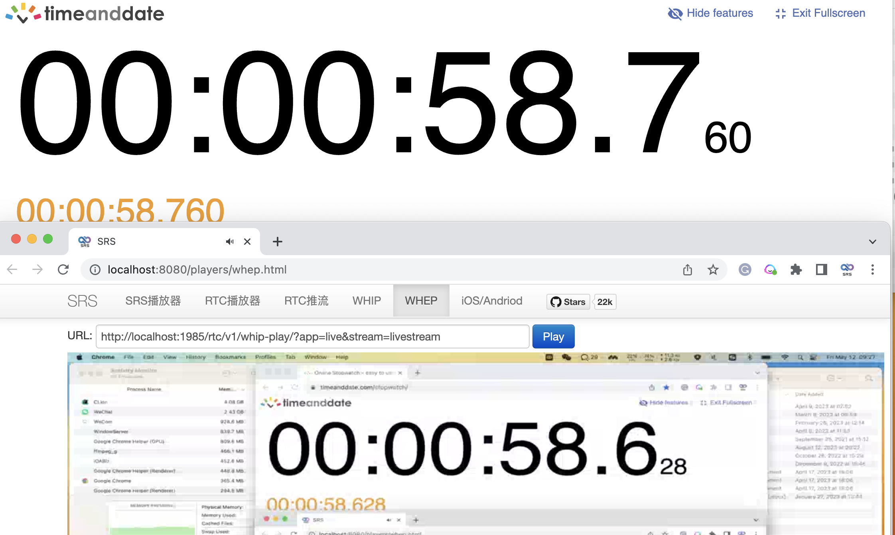

# GSoC 2025 FFmpeg WHIP

<div align='center' display='flex'>
    
</div>

<div align='center' display='flex'>
    
</div>

## Project Infomation:

### Project Name: Implementation of WHIP (WebRTC-HTTP Ingestion Protocol) in FFmpeg<sup>[1]</sup>

### Mentor: Steven Liu, Jun Zhao

### Student: Jack Lau

---

## Description

This project aims to add WebRTC (Real-Time Communication) muxer that supports sub-second latency streaming according to the WHIP (WebRTC-HTTP ingestion protocol) specification.

Before GSoC, the initial WHIP patch was written by Winlin and many other RTC developers.

My first GSoC work is to refactor and improve code until it can be merged into FFmpeg.

## What i did

- Refactor the openssl DTLS code and merge it into tls code
- Fix some bugs of whip and refactor it to make it more stable
- Add more features like NACK, RTX, DTLS active mode
- Implement dtls support for more ssl libs like gnutls, mbedtls.

## The current state

This WHIP muxer and openssl DTLS has been successfully merged into FFmpeg and released in FFmpeg 8.0 version

Using SRS as an example, let’s try pushing a WHIP stream with FFmpeg and measuring the latency.<sup>[2]</sup>
```shell
ip="192.168.3.85"
docker run --rm -it -p 1935:1935 -p 1985:1985 -p 8080:8080 \
    --env CANDIDATE=$ip -p 8000:8000/udp \
    ossrs/srs:5 ./objs/srs -c conf/rtc2rtmp.conf
```
To download the code and build FFmpeg, you can use the following command.
```shell
cd ~/git
git clone https://git.ffmpeg.org/ffmpeg.git
cd ffmpeg
./configure --enable-openssl --enable-version3 \
    --enable-libx264 --enable-gpl --enable-libopus
make -j
```
Capture your screen, and measure the end-to-end latency (use stopwatch).
```shell
ffmpeg -f avfoundation -framerate 25 -pixel_format yuyv422 -i "2:0" \
    -vcodec libx264 -pix_fmt yuv420p -profile:v baseline -preset:v ultrafast \
    -b:v 800k -s 1024x576 -r 25 -g 50 -tune zerolatency -threads 1 -bf 0 \
    -acodec libopus -ar 48000 -ac 2 \
    -f whip "http://localhost:1985/rtc/v1/whip/?app=live&stream=livestream"
```
After publishing stream to SRS, you can play the WHIP stream in web browser such as Chrome, using srs-player.

Then you'll find that it can achieve latency around 150ms:


## What's left to do

- to make the more features like NACK, RTX, DTLS active mode be merged
- to make dtls support for multi ssl(gnutls, mbedtls) be merged.
- refactor the SDP logic to make it can directly utilize the sdp.c of FFmpeg.
- implment the multi-codec support(e.g. H265, AV1, VP9)
- maintaining the WHIP and DTLS code and add more features.

## What code got merged (or not) upstream

Merged:

- The basic WHIP muxer and DTLS support<sup>[3]</sup>
- [Many fixes and improvments]<sup>[4]</sup>

Waiting for merge:
- NACK, RTX
- DTLS active mode
- DTLS for multi ssl(gnutls, mbedtls)

## Any challengs or important things i learned during the project

- When entering a new field, there are always many difficulties. At the beginning of this project, I not only had to study the WHIP-related standards, but also understand the existing code structure, FFmpeg’s framework design, the usage of OpenSSL APIs, and the challenges of multi-version compatibility. Being open-minded and frequently seeking guidance from my mentors greatly accelerated this process and even helped me avoid many detours.

- All roads lead to Rome — the solution one personally believes is correct may not necessarily be the optimal one. It’s important to consider the overall structure, rather than focusing only on the parts of the code related to oneself.

- For a foundational library like FFmpeg, code quality, stability, and performance are of the highest importance.I’ve learned a great deal from working on it — such as using bitwise operations to improve performance, writing code in compliance with international standards, and optimizing code structure for long-term maintainability.These lessons have contributed enormously to my growth as a programmer, in ways that are hard to fully put into words.

## Conclusion

As a newcomer to programming, I feel very fortunate to work alongside so many experienced developers and contribute together to open source. The excitement and sense of achievement when seeing my code merged upstream is truly unparalleled.

I would like to express my gratitude to my mentors Steven Liu and Jun Zhao, to Winlin as the initial author of WHIP, and to the many RTC developers and FFmpeg maintainers for their support and guidance.


<div class="references">
    <h2>References</h2>
    <p>[1] https://summerofcode.withgoogle.com/programs/2025/projects/CjXkqCQX</p>
    <p>[2] https://github.com/ossrs/ffmpeg-webrtc/discussions/37</p>
    <p>[3] https://github.com/FFmpeg/FFmpeg/commit/167e343bbe75515a80db8ee72ffa0c607c944a00</p>
    <p>[4] https://github.com/FFmpeg/FFmpeg/commits?author=JackLau1222&since=2025-06-01&until=2025-08-28</p>
</div>

<style>
.references {
    margin-top: 2em;
    border-top: 1px solid #ccc;
    padding-top: 1em;
    font-size: 0.9em;
}
.references p {
    margin: 0.5em 0;
    text-indent: -2em;
    padding-left: 2em;
}
</style>